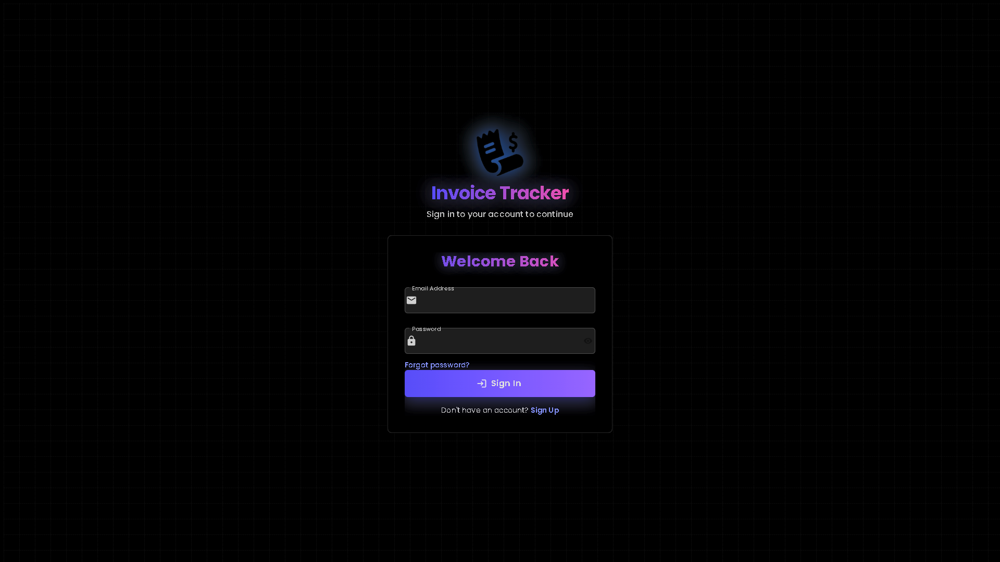

<div align="center">
  
  
# Invoice Tracker

  <p>
    A modern, elegant solution for tracking and managing invoices with advanced approval workflows
  </p>

  <p>
    <a href="#features">Features</a> •
    <a href="#demo">Demo</a> •
    <a href="#tech-stack">Tech Stack</a> •
    <a href="#installation">Installation</a> •
    <a href="#usage">Usage</a> •
    <a href="#challenges">Challenges & Solutions</a> •
    <a href="#roadmap">Roadmap</a> •
    <a href="#contributing">Contributing</a> •
    <a href="#author">Author</a> •
    <a href="#license">License</a>
  </p>
  
  <p>
    <a href="https://github.com/yourusername/invoice-tracker/stargazers">
      
    </a>
    <a href="https://github.com/yourusername/invoice-tracker/network/members">
      
    </a>
    <a href="https://github.com/yourusername/invoice-tracker/issues">
      
    </a>
    <a href="https://github.com/yourusername/invoice-tracker/blob/main/LICENSE">
      
    </a>
  </p>
</div>

## 📋 Overview

Invoice Tracker is a comprehensive web application built to streamline invoice management for organizations of all sizes. It provides a robust platform for tracking, approving, and managing invoices throughout their lifecycle, from submission to payment.

The application implements a sophisticated role-based authorization system that enforces proper separation of duties in the invoice approval workflow, while maintaining a responsive, intuitive user interface for all device types.

## ✨ Features <a name="features"></a>

### 🔐 Authentication & Security
- **Multi-method Authentication**: Secure login via email/password or Google Sign-In
- **Role-based Access Control**: Different permissions for administrators and reviewers
- **Secure Data Storage**: All data encrypted and secured through Firebase

### 📊 Dashboard & Analytics
- **Real-time Overview**: Dynamic dashboard showing key metrics and pending actions
- **Visual Reports**: Charts and graphs for invoice status distribution
- **Activity Timeline**: Record of recent actions and status changes

### 📄 Invoice Management
- **Comprehensive CRUD Operations**: Create, read, update, and delete invoices
- **Attachment Support**: Upload and store PDF/image attachments with invoices
- **Advanced Filtering & Sorting**: Find invoices by status, date, amount, vendor
- **Pagination & Infinite Scrolling**: Efficiently handle large sets of invoices

### ⚙️ Workflow & Approvals
- **Multi-stage Approval Process**: Define custom approval workflows
- **Status Tracking**: Monitor invoice progress through the approval pipeline
- **Automated Notifications**: Keep stakeholders informed of status changes

### 👥 User & Organization Management
- **User Administration**: Add, update, or remove users (admin only)
- **Profile Management**: Update personal information and preferences
- **Organization Settings**: Configure company details and approval requirements

### 📱 Responsive Design
- **Device Compatibility**: Optimized for desktop, tablet, and mobile devices
- **Intuitive Interface**: Modern UI with clear navigation and consistent styling

## 🖥️ Demo <a name="demo"></a>

<div align="center">
  <!-- Dashboard Screenshot -->
  
  
  <!-- Invoice List Screenshot -->
  
  
  <!-- Invoice Detail Screenshot -->
  
  
  <!-- Login Page Screenshot -->
  
  
  <!-- Organization Management Screenshot -->
  
  
  <!-- Profile Page Screenshot -->
  
  
  <!-- Activity Timeline Screenshot -->
  
</div>

## 🛠️ Tech Stack <a name="tech-stack"></a>

<div align="center">
  <table>
    <tr>
      <td align="center" width="96">
        
        <br>React
      </td>
      <td align="center" width="96">
        
        <br>Redux
      </td>
      <td align="center" width="96">
        
        <br>Material UI
      </td>
      <td align="center" width="96">
        
        <br>Firebase
      </td>
      <td align="center" width="96">
        
        <br>JavaScript
      </td>
    </tr>
    <tr>
      <td align="center" width="96">
        
        <br>HTML5
      </td>
      <td align="center" width="96">
        
        <br>CSS3
      </td>
      <td align="center" width="96">
        
        <br>TailwindCSS
      </td>
      <td align="center" width="96">
        
        <br>Node.js
      </td>
      <td align="center" width="96">
        
        <br>Vite
      </td>
    </tr>
  </table>
</div>

### Architecture Overview

- **Frontend**: React for UI components, Redux for state management, Material UI for design system
- **Backend**: Firebase services (Authentication, Realtime Database, Storage)
- **State Management**: Redux Toolkit for efficient state handling
- **Data Flow**: Asynchronous actions with Redux Thunks
- **Performance Optimization**: Code splitting, lazy loading, memoization

## 🚀 Installation <a name="installation"></a>

### Prerequisites

- Node.js (v16 or later)
- npm or yarn
- Firebase account with Realtime Database and Authentication enabled

### Step-by-Step Setup

1. **Clone the repository**
```bash
git clone https://github.com/yourusername/invoice-tracker.git
cd invoice-tracker
```

2. **Install dependencies**
```bash
npm install
# or with yarn
yarn install
```

3. **Configure Firebase Environment Variables**
   
   Create a `.env.local` file in the root directory with your Firebase configuration:

```plaintext
VITE_FIREBASE_API_KEY=your-api-key
VITE_FIREBASE_AUTH_DOMAIN=your-project.firebaseapp.com
VITE_FIREBASE_PROJECT_ID=your-project-id
VITE_FIREBASE_STORAGE_BUCKET=your-storage-bucket
VITE_FIREBASE_MESSAGING_SENDER_ID=your-messaging-sender-id
VITE_FIREBASE_APP_ID=your-app-id
VITE_FIREBASE_DATABASE_URL=https://your-project.firebaseio.com
```

4. **Start the development server**
```bash
npm run dev
# or with yarn
yarn dev
```

5. **Access the application**

   Open your browser and navigate to: `http://localhost:5173`

### Firebase Setup

1. Create a new Firebase project in the [Firebase Console](https://console.firebase.google.com/)
2. Enable Authentication (Email/Password and Google providers)
3. Set up Realtime Database with the following security rules:

```json
{
  "rules": {
    "users": {
      ".read": "auth != null",
      ".write": "auth != null && root.child('users').child(auth.uid).child('role').val() === 'admin'"
    },
    "organizations": {
      "$orgId": {
        ".read": "auth != null && root.child('users').child(auth.uid).child('organization').val() === $orgId",
        ".write": "auth != null && 
                  (root.child('users').child(auth.uid).child('role').val() === 'admin' || 
                  (root.child('users').child(auth.uid).child('organization').val() === $orgId && 
                   root.child('users').child(auth.uid).child('role').val() === 'reviewer'))"
      }
    }
  }
}
```

4. Configure storage rules for invoice attachments

## 📖 Usage <a name="usage"></a>

### Initial Admin Setup

By default, all new users are registered with the "reviewer" role. To create an admin user:

1. Register a new user through the `/auth` page
2. Open your browser console on the `/dashboard` page
3. Run the following code to list all users:
```javascript
import { listUsers } from './scripts/promoteToAdmin';
listUsers();
```
4. Promote your user to admin:
```javascript
import { promoteToAdmin } from './scripts/promoteToAdmin';
promoteToAdmin('your-email@example.com');
```

### User Workflows

#### As an Admin

- Manage users and their roles
- Configure organization settings
- Approve/reject invoices
- View all invoices within the organization
- Generate reports and analytics

#### As a Reviewer

- View invoices assigned to them
- Approve/reject invoices based on their review
- Comment on invoices during the review process
- Track status of previously reviewed invoices

### Invoice Lifecycle

1. **Creation**: User creates a new invoice with required details and attachments
2. **Review**: Assigned reviewers evaluate the invoice
3. **Approval/Rejection**: Reviewers approve or reject the invoice with comments
4. **Payment**: Admin marks approved invoices as paid
5. **Archival**: Completed invoices are stored for record-keeping

## 🧩 Challenges & Solutions <a name="challenges"></a>

### Real-time Data Synchronization

**Challenge**: Ensuring all users see the most current invoice data without excessive API calls.

**Solution**: Implemented Firebase Realtime Database with optimized listeners that update only changed components, reducing unnecessary renders while maintaining data consistency.

### Complex Approval Workflows

**Challenge**: Supporting various approval paths based on invoice amount, department, or vendor.

**Solution**: Designed a flexible workflow engine that allows for custom approval chains with conditional logic based on invoice attributes.

### Mobile Responsiveness

**Challenge**: Providing a seamless experience across devices while maintaining full functionality.

**Solution**: Utilized responsive design principles with Material UI's grid system and breakpoints, along with custom component variants for different screen sizes.

### Performance Optimization

**Challenge**: Maintaining fast load times and smooth interactions as the application scales.

**Solution**: Implemented code splitting, lazy loading, virtualization for long lists, and memoization techniques to minimize unnecessary rendering.

### Secure File Storage

**Challenge**: Securely storing and managing invoice attachments with proper access controls.

**Solution**: Leveraged Firebase Storage with custom security rules that restrict access based on user roles and organization membership.

## 🔮 Roadmap <a name="roadmap"></a>

- [ ] **Email Notifications**: Automated email alerts for pending approvals
- [ ] **Advanced Analytics**: Enhanced reporting with export capabilities
- [ ] **Multi-language Support**: Internationalization for global users
- [ ] **Mobile App**: Native mobile applications for iOS and Android
- [ ] **API Integration**: Connect with accounting software (QuickBooks, Xero)
- [ ] **OCR Processing**: Automated data extraction from invoice images
- [ ] **Custom Fields**: User-defined fields for organization-specific needs

## 👥 Contributing <a name="contributing"></a>

Contributions are what make the open-source community such an amazing place to learn, inspire, and create. Any contributions you make are **greatly appreciated**.

### How to Contribute

1. Fork the repository
2. Create your feature branch (`git checkout -b feature/amazing-feature`)
3. Commit your changes (`git commit -m 'Add some amazing feature'`)
4. Push to the branch (`git push origin feature/amazing-feature`)
5. Open a Pull Request

### Code Style

- Follow the existing code style and conventions
- Write clear, descriptive commit messages
- Keep code modular and maintainable
- Add appropriate documentation

## 👨‍💻 Author <a name="author"></a>

<div align="center">
  
  <h3>Kafil Khan</h3>
  
  <p>Full-stack developer passionate about creating elegant, efficient web applications</p>
  
  <a href="https://twitter.com/_Kafilkhan_">
    
  </a>
  <a href="https://www.linkedin.com/in/kafilcodes/">
    
  </a>
  <a href="https://www.instagram.com/_kafilkhan/">
    
  </a>
  <a href="https://github.com/yourusername">
    
  </a>
</div>

## 💖 Support <a name="support"></a>

<div align="center">
  <p>If you find this project useful, please consider supporting its development!</p>
  
  <a href="https://www.buymeacoffee.com/kafilkhan" target="_blank">
    
  </a>
</div>

## 📝 License <a name="license"></a>

Distributed under the MIT License. See `LICENSE` for more information.

---

<div align="center">
  <p>⭐ Star this repository if you found it useful! ⭐</p>
  <p>Made with ❤️ by Kafil Khan</p>
</div>
